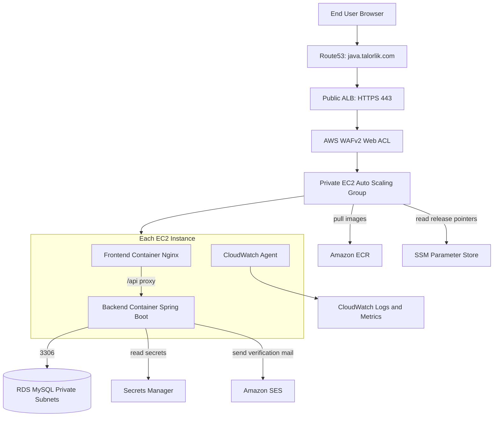
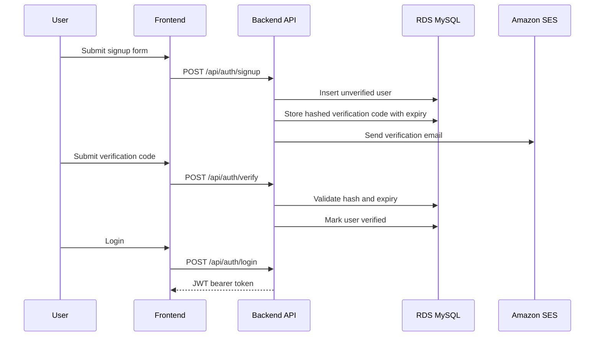
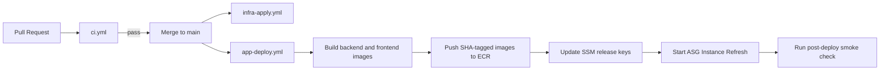

# Dockerized Java App on EC2 Architecture

## 1. Purpose

This document defines the production architecture for deploying a Dockerized
Java application on AWS EC2.
It consolidates the project planning documentation, technical requirements, and
accepted ADR decisions into a single operational architecture view.
The current Dockerized Java app is the sample workload used to validate this
deployment pattern.

## 2. System Scope

The project demonstrates:

- A repeatable reference architecture for deploying Dockerized Java workloads on
  EC2 with Terraform and GitHub Actions
- A secure runtime model with private compute, managed secrets, and controlled
  ingress
- An operations model with health checks, observability, and controlled rollout

The sample application provides:

- Public user signup and email verification
- Authenticated user profile management
- Admin user management and audit visibility

Core runtime principles:

- EC2 instances are stateless and replaceable
- Shared state is stored in Amazon RDS MySQL

## 3. Architecture Drivers

- **Security first**: private compute and database tiers, least-privilege IAM,
  managed secrets, IMDSv2 enforcement, and WAF at the edge
- **Reliability**: Auto Scaling Group baseline of two instances and health-based
  replacement
- **Repeatability**: Terraform-managed infrastructure and GitHub Actions OIDC
- **Operational clarity**: CloudWatch metrics, logs, dashboards, and alarms

## 4. High-Level Topology

## 5. Account and Trust Model

- **Deployment account** owns VPC, ALB, ASG, EC2, RDS, ECR, Secrets Manager,
  ACM certificate, SES, and observability resources
- **Domain account** owns Route53 hosted zone for `talorlik.com`
- Terraform uses:
  - Default `aws` provider for deployment account resources
  - Aliased `aws.domain` provider for Route53 operations in the domain account
- GitHub Actions assumes deployment role via OIDC, then optionally assumes
  domain DNS role for cross-account DNS changes

## 6. Runtime Components

- **Frontend**: vanilla HTML/CSS/JavaScript served by Nginx (ADR 0001)
- **Backend**: Spring Boot API with Spring Security, JPA, Flyway, and JWT auth
  (ADR 0002)
- **Database**: private RDS MySQL with Multi-AZ posture for production
- **Security edge**: WAFv2 attached to ALB with AWS managed rule sets and
  per-IP rate limiting (ADR 0003)

## 7. Network and Security Boundaries

- ALB is the only public ingress on TCP `443`
- EC2 instances run in private app subnets and receive traffic only from ALB
- RDS runs in private DB subnets and accepts TCP `3306` only from app SG
- No SSH public ingress; operational access uses SSM Session Manager
- Launch template enforces IMDSv2 and encrypted root volumes

## 8. Data and Persistence Model

Core tables managed by Flyway migrations:

- `users`
- `roles`
- `verification_codes`
- `audit_events`

Data rules:

- Unique email constraint at DB level
- Verification codes stored as hashed values with expiration
- Admin seed is idempotent and secret-driven

## 9. Sample App Auth and User Lifecycle

## 10. Secret and Key Management

Secret namespace: `/java-app/prod/*`

Primary secrets:

- `/java-app/prod/db/app-user`
- `/java-app/prod/admin`
- `/java-app/prod/jwt`
- `/java-app/prod/ses`

Rotation strategy (ADR 0005):

- RDS master secret: managed rotation
- App DB user: coordinated secret update and DB credential change
- JWT secret: rotate then trigger instance refresh
- Admin secret: update secret for future bootstrap consistency

## 11. CI/CD and Deployment Architecture

Release metadata keys:

- `/java-app/prod/backend-image-tag`
- `/java-app/prod/frontend-image-tag`
- `/java-app/prod/release-id`

## 12. Observability and Operations

- CloudWatch Agent collects host metrics and runtime logs
- ALB access logs are stored in S3
- CloudWatch dashboards include ALB, ASG, EC2, RDS, and app-level indicators
- Alarm set covers ALB 5xx, unhealthy targets, RDS stress, EC2 disk pressure,
  and ASG refresh failures

## 13. Architecture Decisions Snapshot

- **ADR 0001**: Frontend stack is vanilla HTML/CSS/JS
- **ADR 0002**: Auth uses stateless JWT bearer tokens
- **ADR 0003**: WAFv2 is enabled in v1
- **ADR 0005**: Secret rotation uses per-secret operational strategy
- **ADR 0006**: Two-account Terraform provider and role model

## 14. Non-Goals

- Kubernetes or ECS migration in current scope
- Multi-region active-active deployment
- Full enterprise observability platform beyond AWS-native baseline

## 15. Acceptance Alignment

The architecture is considered valid when these conditions hold in production:

- `https://java.talorlik.com` serves valid TLS via ALB
- At least two healthy app instances are in service behind ALB
- The sample app flows (signup, verification, login, profile, admin) work
  end-to-end
- New SHA-tagged release rolls out via ASG instance refresh
- EC2 and RDS remain private with no direct public ingress
